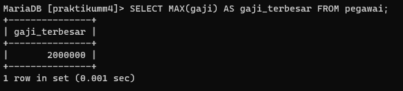

# Tugas Praktikum 4 { Pertemuan ke 11 }


| **Nama**            | **NIM**   | **Kelas** | **Matkul** |
| ------------------- | --------- | --------- | ---------- |
| Ahmad Ridho Septian | 312310447 | TI.23.A5  | Basis Data |

# Lakukan pengisian tabel pegawai:

```
CREATE TABLE pegawai (
    idpegawai CHAR(4) PRIMARY KEY,
    nama_depan VARCHAR(50),
    nama_belakang VARCHAR(50),
    email VARCHAR(100),
    telepon VARCHAR(15),
    tgl_kontrak DATE,
    id_job CHAR(5),
    gaji INT,
    tunjangan INT
);

INSERT INTO pegawai (idpegawai, nama_depan, nama_belakang, email, telepon, tgl_kontrak, id_job, gaji, tunjangan) VALUES
('E001', 'Ferry', 'gustiawan', 'ferry@yahoo.com', '07117059004', '2005-09-01', 'L0001', 2000000, 500000),
('E002', 'aris', 'ganiardi', 'aris@yahoo.com', '081312345678', '2006-09-01', 'L0002', 2000000, 200000),
('E003', 'faiz', 'ahnad', 'faiz@gmail.com', '081367384322', '2006-10-01', 'L0003', 1500000, NULL),
('E004', 'emna', 'bunton', 'enna@gmail.com', '081363484342', '2006-10-01', 'L0004', 1500000, 9),
('E005', 'mike', 'scoff', 'mike@plasa.com', '08163454555', '2007-09-01', 'L0005', 1250000, 9),
('E006', 'lincoln', 'burrows', 'linc@yahoo.com', '08527388432', '2008-09-01', 'L0006', 1750000, NULL);

```


**_Output :_**


# Soal Praktikum

### 1. Pegawai yang gajinya bukan 2.000.000 dan 1.250.000:


Query ini akan menampilkan pegawai dengan gaji selain 2.000.000 dan 1.250.000. Berdasarkan data yang ada, pegawai yang memenuhi kriteria ini adalah:

- E003: faiz ahnad, dengan gaji 1.500.000
- E004: emna bunton, dengan gaji 1.500.000
- E006: lincoln burrows, dengan gaji 1.750.000

### 2. Pegawai yang tunjangannya NULL:


Query ini menampilkan pegawai yang tidak menerima tunjangan. Pegawai tersebut adalah:

### 3. Pegawai yang tunjangannya tidak NULL:


Query ini menampilkan pegawai yang menerima tunjangan. Pegawai tersebut adalah:

- E001: Ferry gustiawan
- E002: aris ganiardi
- E004: emna bunton
- E005: mike scoff

### 4. Jumlah baris/record tabel pegawai:


Query ini menghitung jumlah total pegawai dalam tabel. Hasilnya adalah:

- Total pegawai: 6

### 5. Jumlah total gaji di tabel pegawai:


Query ini menghitung total gaji yang diberikan kepada semua pegawai. Hasilnya adalah:

- Total gaji: 10.000.000

### 6. Rata-rata gaji pegawai:


Query ini menghitung rata-rata gaji pegawai. Hasilnya adalah:

- Rata-rata gaji: 1666666.6667

### 7. Gaji Terkecil


Query ini menampilkan gaji terkecil yang diterima oleh pegawai. Hasilnya adalah:

- Gaji terkecil: 1.250.000

### 8. Gaji Terbesar



Query ini menampilkan gaji terbesar yang diterima oleh pegawai. Hasilnya adalah:

- Gaji terbesar: 2.000.000

### Kesimpulan:

- Sebagian besar pegawai menerima gaji sebesar 2.000.000 atau 1.250.000, kecuali tiga pegawai yang menerima gaji sebesar 1.500.000 dan 1.750.000.
- Sebagian besar pegawai menerima tunjangan, kecuali dua pegawai yang tunjangannya NULL.
- Total jumlah pegawai dalam tabel adalah 6.
- Total gaji yang diberikan kepada semua pegawai adalah 10.500.000.
- Rata-rata gaji pegawai adalah 1666666.6667.
- Gaji terkecil yang diterima adalah 1.250.000 dan gaji terbesar adalah 2.000.000.

# Lakukan pengisian tabel hewan:

```
CREATE TABLE hewan (
    id VARCHAR(2) PRIMARY KEY,
    name VARCHAR(50),
    owner VARCHAR(50),
    species VARCHAR(50),
    sex CHAR(1)
);

INSERT INTO hewan (id, name, owner, species, sex) VALUES
('p1', 'Puffball', 'Diane', 'Hamster', 'f'),
('p2', 'Claws', 'Gwen', 'cat', 'm'),
('p3', 'Fluffy', 'Haro', 'cat', 'f'),
('p4', 'Buffy', 'Haro', 'dog', 'f'),
('p5', 'Fang', 'Benny', 'dog', 'm'),
('p6', 'Bowser', 'Diane', 'dog', 'm'),
('p7', 'Chirpy', 'Gwen', 'bird', 'f'),
('p8', 'Whistler', 'Gwen', 'bird', NULL),
('p9', 'Slim', 'Benny', 'snake', 'm');


```


**_Output :_**


# Soal Praktikum

### 1. Jumlah hewan yang dimiliki setiap owner:


- Diane memiliki 2 hewan
- Gwen memiliki 3 hewan
- Haro memiliki 2 hewan
- Benny memiliki 2 hewan

### 2. Jumlah hewan berdasarkan spesies:


- Hamster: 1 hewan
- Cat: 2 hewan
- Dog: 3 hewan
- Bird: 2 hewan
- Snake: 1 hewan

### 3. Jumlah hewan berdasarkan jenis kelamin:


- Female (f): 4 hewan
- Male (m): 4 hewan
- NULL (jenis kelamin tidak diketahui): 1 hewan

### 4. Jumlah hewan berdasarkan spesies dan jenis kelamin:


- Hamster, Female: 1 hewan
- Cat, Female: 1 hewan
- Cat, Male: 1 hewan
- Dog, Female: 1 hewan
- Dog, Male: 2 hewan
- Bird, Female: 1 hewan
- Bird, NULL: 1 hewan
- Snake, Male: 1 hewan

### 5. Jumlah hewan berdasarkan spesies (cat dan dog saja) dan jenis kelamin:


- Cat, Female: 1 hewan
- Cat, Male: 1 hewan
- Dog, Female: 1 hewan
- Dog, Male: 2 hewan

### 6. Jumlah hewan berdasarkan jenis kelamin yang diketahui saja:


- Female (f): 4 hewan
- Male (m): 4 hewan

### Kesimpulan :

Dari hasil ini, kita bisa menyimpulkan bahwa pemilik hewan yang paling banyak adalah Gwen, spesies yang paling banyak dimiliki adalah dog, dan jumlah hewan jantan dan betina seimbang jika tidak memperhitungkan yang jenis kelaminnya tidak diketahui.

## FINISH

# _Thank You_
